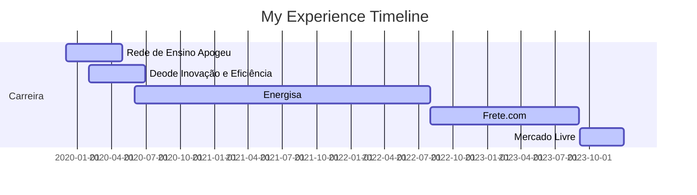

## Hello, I'm Leticia 👋

### ABOUT ME
Currently a Data and Analytics Engineer on the operational intelligence team of Mercado Livre's Fury platform and MBA student in Machine Learning in production at UFSCar. Graduated in Control and Automation Engineering and Specialist in Big Data and Data Science.

I have been working in the data area for years, in projects in different segments such as education, marketing and sales, maintenance engineering, optimization, fraud prevention, severe weather events and academic studies in different areas. Working from data capture and creation of data lakes, data quality analysis, descriptive and diagnostic analysis, modeling, productionization and model monitoring.

Passionate about new technologies, I have a generalist profile, which allows me to quickly adapt to different business areas.

### PROFESSIONAL EXPERIENCE
🛒  Data & Analytics Engineer - Mercado Livre (09/2023 - Current)

🚚  Data Scientist II - Frete.com (08/2022 - 09/2023)

⚡ Data Scientist I - Energisa (06/2020 - 07/2022)

💡 Business Analysis Intern - Deode Inovação e Eficiência (02/2020 - 06/2020)

📚 Data Intern - Rede de Ensino Apogeu (12/2019 - 04/2020)

### EDUCATION
🗞️ MBA em Machine Learning in Production - UFSCar (2023 - 2024)

🗞️ Specialization in Big Data and Data Science - Prominas University (2022 - 2023)

🤖 Bachelor in Control and Automation Engineering - IF-Fluminense (2012 - 2018)

### CERTIFICATIONS
🗞️ Google Data Analytics - Google

🗞️ Generative AI for Data Scientists - IBM
