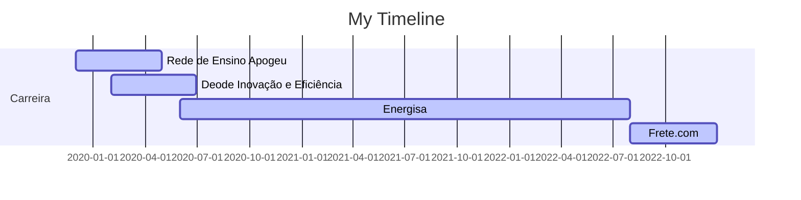

# Olá, eu sou a Letícia 👋

##
Bacharel em Engenharia de Controle e Automação pelo Instituto Federal Fluminense, pós graduanda em Big Data and Data Science e graduanda em Engenharia de Produção com foco em otimização pelo CEFET/RJ. 

## PROFESSIONAL EXPERIENCE
🚚  Data Scientist II - Frete.com (08/2022 - Atual)

⚡ Data Scientist I - Energisa (06/2020 - 07/2022)

💡 Business Analysis Intern - Deode Inovação e Eficiência (02/2020 - 06/2020)

📚 Data Intern - Rede de Ensino Apogeu (12/2019 - 04/2020)

## EDUCATION
🗞️ MBA em Machine Learning in Production - UFSCar (2023 - 2025)

🗞️ Specialization in Big Data and Data Science - Prominas University (2022 - 2023)

🤖 Bachelor in Control and Automation Engineering - IF-Fluminense (2012 - 2018)
