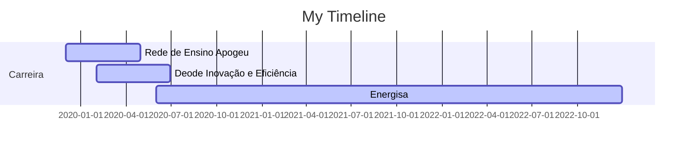

# Olá, eu sou a Letícia 👋

##

  
  

Bacharel em Engenharia de Controle e Automação pelo Instituto Federal Fluminense, pós graduanda em Big Data and Data Science e graduanda em Engenharia de Produção com foco em otimização pelo CEFET/RJ. Atualmente sou Cientista de Dados na Energisa, tendo passado por diversas empresas como: Rede de Ensino Apogeu, Deode Inovação e Eficiência e Energisa. Sou voluntária no LaFaC - Laboratório de Fábricas Celulares da UFSCar dando consultoria em testes de hipóteses, estatísticas descritivas e análise de dados.

## 
   

## Atuação profissional

⚡ Data Scientist - Energisa (06.2020 - Atual)

💡 Business Analysis Intern - Deode Inovação e Eficiência (02.2020 - 06.2020)

:book: Data Intern - Rede de ensino Apogeu (12.2019 - 04.2020)

:shopping_cart:  Suport Technique - DNA Sistemas (10.2018 - 12.2018)

## Formação Acadêmica

 :newspaper_roll: Especialização em Big Data e Data Science - Universidade Prominas (2022 - 2023)

 👩🏽‍🎓 Bacharel em Engenharia de Produção - CEFET/RJ (2019 - 2024)

 🤖 Bacharel em Engenharia de Controle e Automação - IF-Fluminense (2012 - 2018)
