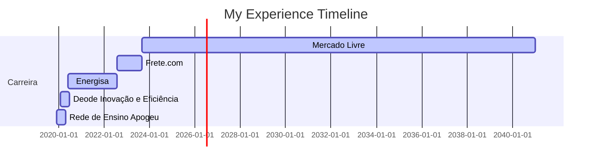

## Hello, I'm Leticia 👋

### ABOUT ME
Data & Analytics Engineer at Mercado Livre, working in the Intelligence Operations team for Fury services. Experience in data architecture and Machine Learning in production, leveraging GCP and AWS, MLflow for model tracking, GitHub for version control, and messaging systems like Pub/Sub and Kafka. 

Focused on ETL/ELT, exploratory data analysis, data visualization (Looker Studio, Power BI), Machine Learning model development, and deployment. Expertise in supervised and unsupervised models, Deep Learning, time series, and generative AI, ensuring monitoring, retraining, and scalability in production. 

Experience across industries including education, marketing, engineering, optimization, fraud prevention, and academic research. Generalist, impact-driven professional, developing scalable, data-driven solutions to support decision-making.

### PROFESSIONAL EXPERIENCE
🛒  Data & Analytics Engineer - Mercado Livre (09/2023 - Current)

🚚  Data Scientist II - Frete.com (08/2022 - 09/2023)

⚡ Data Scientist I - Energisa (06/2020 - 07/2022)

💡 Business Analysis Intern - Deode Inovação e Eficiência (02/2020 - 06/2020)

📚 Data Intern - Rede de Ensino Apogeu (12/2019 - 04/2020)

### EDUCATION
🗞️ Bachelor of Science and Technology - UFMT (2025 - 2029)

🗞️ MBA em Machine Learning in Production - UFSCar (2023 - 2025)

🗞️ Specialization in Big Data and Data Science - Prominas University (2022 - 2023)

🤖 Bachelor in Control and Automation Engineering - IF-Fluminense (2012 - 2018)

### CERTIFICATIONS
🗞️ Google Data Analytics - Google

🗞️ Generative AI for Data Scientists - IBM
