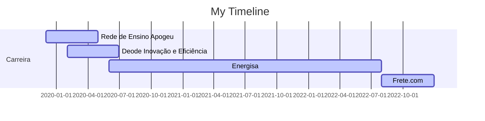

# Hello, I'm Leticia 👋

##
Currently Risk and Fraud Prevention Data Scientist and MBA student in Machine Learning in production at UFSCar. Graduated in Control and Automation Engineering and specialist in Big Data and Data Science.

She has been working with Data Science for 4 years, on projects in different segments such as education, marketing, engineering, optimization, fraud prevention and several academic studies in different areas.

Enthusiastic about new technologies, she considers herself a business-oriented professional with a generalist profile, with an affinity for everything from database structuring, data quality, descriptive and diagnostic analysis, to predictive and prescriptive modeling.

## PROFESSIONAL EXPERIENCE
🚚  Data Scientist II - Frete.com (08/2022 - Atual)

⚡ Data Scientist I - Energisa (06/2020 - 07/2022)

💡 Business Analysis Intern - Deode Inovação e Eficiência (02/2020 - 06/2020)

📚 Data Intern - Rede de Ensino Apogeu (12/2019 - 04/2020)

## EDUCATION
🗞️ MBA em Machine Learning in Production - UFSCar (2023 - 2025)

🗞️ Specialization in Big Data and Data Science - Prominas University (2022 - 2023)

🤖 Bachelor in Control and Automation Engineering - IF-Fluminense (2012 - 2018)
