## Hello, I'm Leticia 👋

```mermaid

gantt
dateFormat  YYYY-MM-DD
title My Experience Timeline

section Carreira
Rede de Ensino Apogeu           :active,, 2019-12-01,2020-04-30
Deode Inovação e Eficiência         :active,, 2020-02-01,2020-06-30
Energisa       :active,, 2020-06-01,2022-07-31
Frete.com         :active,, 2022-08-01,2023-09-01
Mercado Livre    :active,, 2023-09-04, 2023-12-31

```

### ABOUT ME
Currently Risk and Fraud Prevention Data Scientist and MBA student in Machine Learning in production at UFSCar. Graduated in Control and Automation Engineering and specialist in Big Data and Data Science.

I've been working in the data area for years, on projects in different segments such as education, marketing, engineering, optimization, fraud prevention and several academic studies in different areas.

Enthusiastic about new technologies, she is a business-oriented professional with a generalist profile, who has participated in projects ranging from structuring data lakes, data quality, descriptive and diagnostic analysis, modeling and model production.

### PROFESSIONAL EXPERIENCE
🛒  Data & Analytics Engineer - Mercado Livre (09/2023 - Current)

🚚  Data Scientist II - Frete.com (08/2022 - 09/2023)

⚡ Data Scientist I - Energisa (06/2020 - 07/2022)

💡 Business Analysis Intern - Deode Inovação e Eficiência (02/2020 - 06/2020)

📚 Data Intern - Rede de Ensino Apogeu (12/2019 - 04/2020)

### EDUCATION
🗞️ MBA em Machine Learning in Production - UFSCar (2023 - 2025)

🗞️ Specialization in Big Data and Data Science - Prominas University (2022 - 2023)

🤖 Bachelor in Control and Automation Engineering - IF-Fluminense (2012 - 2018)
